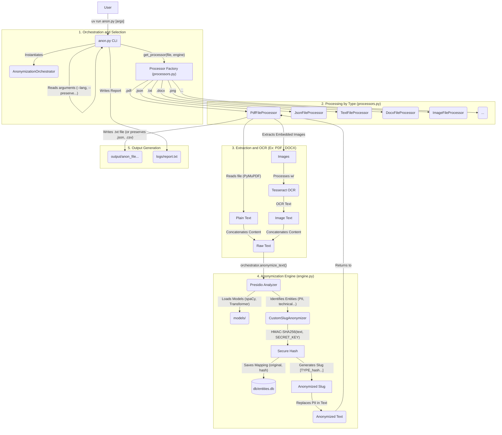

# AnonLFI 2.0: Extensible Anonymization for CSIRTs

A pseudonymization framework for CSIRTs that resolves the conflict between data confidentiality (GDPR/LGPD) and analytical utility. It allows sensitive security incident data to be used safely for threat analysis, detection engineering, and training AI (LLM) models.

## System Architecture

The tool is designed with a modular, layered architecture to separate responsibilities and allow for extensibility. The following diagram illustrates the main components and workflows.



## Key Features

- **Structure-Preserving Processing:** Natively processes `.json` and `.xml` files to preserve their original hierarchy, while also supporting `.txt`, `.csv`, `.pdf`, `.docx`, and `.xlsx`.
- **OCR for Images:** Automatically extracts and anonymizes text embedded in images within PDF and DOCX files. Also supports direct anonymization of image files like `.png`, `.jpeg`, `.gif`, `.bmp`, `.tiff`, `.webp`, and more.
- **Advanced Entity Recognition:** Uses Presidio and a Transformer model (`Davlan/xlm-roberta-base-ner-hrl`) for high-accuracy entity detection.
- **Cybersecurity-Focused Recognizers:** Includes custom logic to detect specific patterns like IP addresses, URLs, hostnames, hashes, UUIDs, and more.
- **Consistent & Secure Anonymization:** Generates stable HMAC-SHA256-based slugs for each unique entity.
- **Controlled De-anonymization:** A separate script allows for retrieving original data from a slug, protected by the same secret key.
- **Configurable:** Allows preserving specific entity types, adding terms to an allow-list, and customizing the anonymized slug length.
- **Directory Processing:** Can process a single file or recursively process all supported files in a directory.

## Technology Stack

This tool is built on top of a powerful stack of open-source libraries:

- **[Presidio](https://microsoft.github.io/presidio/):** Core engine for PII identification and anonymization.
- **[spaCy](https://spacy.io/) & [Hugging Face Transformers](https://huggingface.co/docs/transformers/index):** For state-of-the-art NLP and Named Entity Recognition (NER).
- **[Pandas](https://pandas.pydata.org/):** For efficient processing of structured data formats like CSV and XLSX.
- **[PyMuPDF](https://pymupdf.readthedocs.io/en/latest/) & [python-docx](https://python-docx.readthedocs.io/en/latest/):** For parsing PDF and DOCX files.
- **[Pytesseract](https://github.com/madmaze/pytesseract):** For OCR capabilities to extract text from images.

## Anonymization Mechanism

The integrity of the anonymization process is guaranteed by a secure and consistent hashing mechanism. For each sensitive entity detected (e.g., a person's name), the system performs the following steps:

1.  The entity's text is normalized to remove extra spaces.
2.  An **HMAC-SHA256** hash is generated from the normalized text, using the `ANON_SECRET_KEY` as a secret key. This ensures the hash is unique and impossible to recreate without the key.
3.  The full hash (64 characters) is used as a unique and persistent identifier in the database.
4.  A "slug" (a prefix of the full hash, with a customizable length via `--slug-length`) is used for substitution in the text, making the output more readable.

This process ensures that the same entity (e.g., "John Doe") will always be replaced by the same slug (e.g., `[PERSON_a1b2c3d4]`), maintaining referential consistency in the anonymized data, which is crucial for training AI models.

## Database Schema

The tool uses a SQLite database (`db/entities.db`) to persist the mapping between original entities and their anonymized slugs. The main table, `entities`, has the following structure:

| Column | Type | Description |
| :--- | :--- | :--- |
| `id` | INTEGER | Primary key. |
| `entity_type` | TEXT | The type of the entity (e.g., `PERSON`, `LOCATION`). |
| `original_name` | TEXT | The original text of the detected entity. |
| `slug_name` | TEXT | The short hash (slug) displayed in the anonymized text. |
| `full_hash` | TEXT | The full HMAC-SHA256 hash, used as a unique identifier. |
| `first_seen` | TEXT | Timestamp of when the entity was first seen. |
| `last_seen` | TEXT | Timestamp of when the entity was last seen. |

## Performance Validation

The tool's effectiveness was validated in two representative case studies from the research paper, demonstrating high precision in complex scenarios:

| Scenario | Description | Precision | Recall | F1-Score |
| :--- | :--- | :--- | :--- | :--- |
| **PDF with OCR** | An incident report with PII in text and embedded terminal screenshots. | 100% | 61.9% | 76.5% |
| **OpenVAS XML** | A vulnerability report with nested technical entities (hashes, certs, etc.). | 100% | 85.42% | 92.13% |

The results confirm the engine's accuracy and the value of the specialized OCR and technical recognizers.

## Supported Entities & Languages

#### Entities
By default, the tool is configured to detect and anonymize a wide range of PII and cybersecurity-related entities:
- `PERSON`
- `LOCATION`
- `ORGANIZATION`
- `EMAIL_ADDRESS`
- `PHONE_NUMBER`
- `IP_ADDRESS`
- `URL`
- `HOSTNAME`
- `HASH` (e.g., SHA256, MD5)
- `UUID`
- `CERT_SERIAL` (Certificate Serials)
- `CPE_STRING` (Common Platform Enumeration)
- `CERT_BODY` (Base64 Certificate Bodies)

*This list can be retrieved by running `uv run anon.py --list-entities`.*

#### Languages
The tool is pre-configured for **24 languages**:

| Code | Language |
| :--- | :--- |
| `ca` | Catalan |
| `zh` | Chinese |
| `hr` | Croatian |
| `da` | Danish |
| `nl` | Dutch |
| `en` | English |
| `fi` | Finnish |
| `fr` | French |
| `de` | German |
| `el` | Greek |
| `it` | Italian |
| `ja` | Japanese |
| `ko` | Korean |
| `lt` | Lithuanian |
| `mk` | Macedonian |
| `nb` | Norwegian Bokmål |
| `pl` | Polish |
| `pt` | Portuguese |
| `ro` | Romanian |
| `ru` | Russian |
| `sl` | Slovenian |
| `es` | Spanish |
| `sv` | Swedish |
| `uk` | Ukrainian |

*For a full list of supported languages, run `uv run anon.py --list-languages`.*

## Repository Structure

```
.
├── anon.py                # Main CLI entry point for the tool
├── scripts/               # Utility scripts (e.g., deanonymize.py)
├── src/anon/              # Main application source code
│   ├── __init__.py
│   ├── config.py          # Configuration, constants, and database functions
│   ├── engine.py          # Core anonymization logic and Presidio orchestration
│   └── processors.py      # File-specific processing classes (PDF, DOCX, etc.)
├── tests/                 # Integration and unit tests
├── db/                    # (Generated) SQLite database for entity storage
├── logs/                  # (Generated) Execution reports
├── models/                # (Generated) Downloaded NLP models
├── output/                # (Generated) Anonymized output files
├── pyproject.toml         # Project dependencies for `uv`
├── uv.lock                # Locked dependency versions
└── README.md              # This file
```

## Prerequisites

1.  **`uv` Tool**:
    -   **Windows:** `powershell -ExecutionPolicy ByPass -c "irm https://astral.sh/uv/install.ps1 | iex"`
    -   **Linux/macOS:** `curl -LsSf https://astral.sh/uv/install.sh | sh`

2.  **Tesseract OCR**:
    -   Required to extract text from images in PDF and DOCX files.
    -   **Ubuntu/Debian:** `sudo apt update && sudo apt install tesseract-ocr`
    -   **macOS (Homebrew):** `brew install tesseract`
    -   **Windows:** Download the installer from the [Tesseract documentation](https://github.com/tesseract-ocr/tesseract#installing-tesseract) and add the installation path to the `PATH` environment variable.

## Installation and Execution

1.  **Clone the repository:**
    ```bash
    git clone https://github.com/AnonShield/AnonLFI2.0.git
    ```

2.  **Set the Secret Key (Mandatory):**
    The system's security depends on a secret key. **The tool will not run without it.**
    -   **Linux/macOS:** `export ANON_SECRET_KEY='your-super-secret-key-here'`
    -   **Windows (PowerShell):** `$env:ANON_SECRET_KEY='your-super-secret-key-here'`

3.  **Install Dependencies:**
    ```bash
    uv sync
    ```
    *On the first run, the required AI models will be downloaded, which may take a few minutes.*

## Usage

Anonymized files are saved in the `output/` directory with the format `anon_{original_filename}.ext`.

#### Anonymization Example

**Original Text:**
```
Analyst John Doe (john.doe@email.com) reported a failure on Server-01.
```
**Anonymized Text (with `--slug-length 8`):
```
Analyst [PERSON_a1b2c3d4] ([EMAIL_ADDRESS_b2c3d4e5]) reported a failure on Server-01.
```

#### Main Commands

**Anonymize a file or directory:**
```bash
# Process a single file
uv run anon.py path/to/your/file.txt

# Process an entire directory
uv run anon.py path/to/your/directory/
```

**De-anonymize a Slug:**
```bash
uv run scripts/deanonymize.py "[PERSON_...hash...]"
```

**Command-Line Options:**
- `file_path`: The path to the target file or directory to be anonymized.
- `--lang <code>`: Sets the document's language (e.g., `en`, `pt`). Default: `en`.
- `--preserve-entities <TYPES>`: A comma-separated list of entity types to *not* anonymize (e.g., `"LOCATION,HOSTNAME"`).
- `--allow-list <TERMS>`: A comma-separated list of terms to ignore.
- `--slug-length <NUM>`: Sets the character length of the hash displayed in the slug (1-64). Defaults to 64 (the full hash) if not specified.
- `--list-entities`: Lists all supported entity types and exits.
- `--list-languages`: Lists all supported languages and exits.

**Example with Options:**
```bash
uv run anon.py incident_report.pdf --lang en --preserve-entities "HOSTNAME" --slug-length 12
```

### Running Tests
To verify the tool's integrity, run the test suite:
```bash
uv run python -m unittest tests/test_anon_integration.py
```

## Utility Scripts

The `scripts/` directory contains several helper scripts for analysis and management.

#### `deanonymize.py`
**Function:** Reverses the anonymization of a single slug, revealing the original text. Requires the `ANON_SECRET_KEY` to be set and supports audit logging.
**Usage:**
```bash
uv run scripts/deanonymize.py "[PERSON_a1b2c3d4...]"
```

#### `get_metrics.py`
**Function:** Reads all execution reports from the `logs/` folder, aggregates the data, and displays performance statistics.
**Usage:**
```bash
uv run scripts/get_metrics.py
```

#### `get_runs_metrics.py`
**Function:** Runs the main anonymization script multiple times on a test set to collect aggregate performance metrics. Results are saved to `metrics_runs.csv`.
**Usage:**
```bash
uv run scripts/get_runs_metrics.py <path_to_test_folder>
```

#### `get_ticket_count.py`
**Function:** Counts the number of "tickets" in a directory. For `.csv` and `.xlsx` files, a ticket is one row. For all other file types, each file is a single ticket.
**Usage:**
```bash
uv run scripts/get_ticket_count.py <path_to_directory>
```

#### `count_eng.py`
**Function:** Scans `.csv` files in a directory and counts the number of cells containing common English words.
**Usage:**
```bash
uv run scripts/count_eng.py <path_to_csv_folder>
```

## License

This tool is licensed under the [GPL-3.0](./LICENSE).
